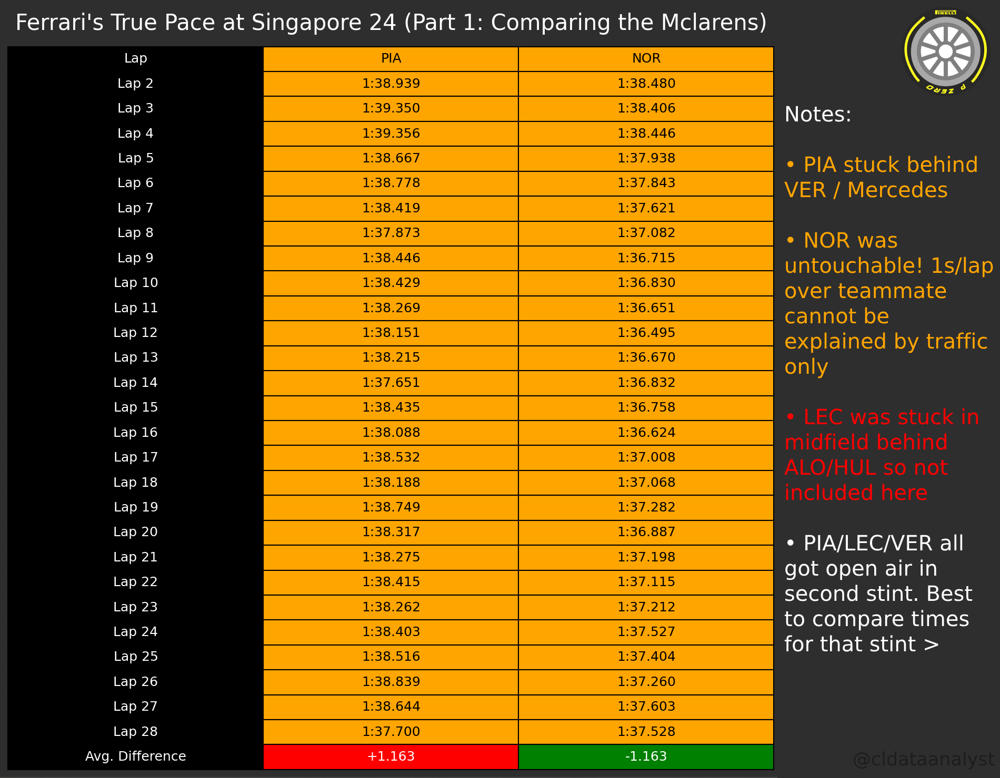
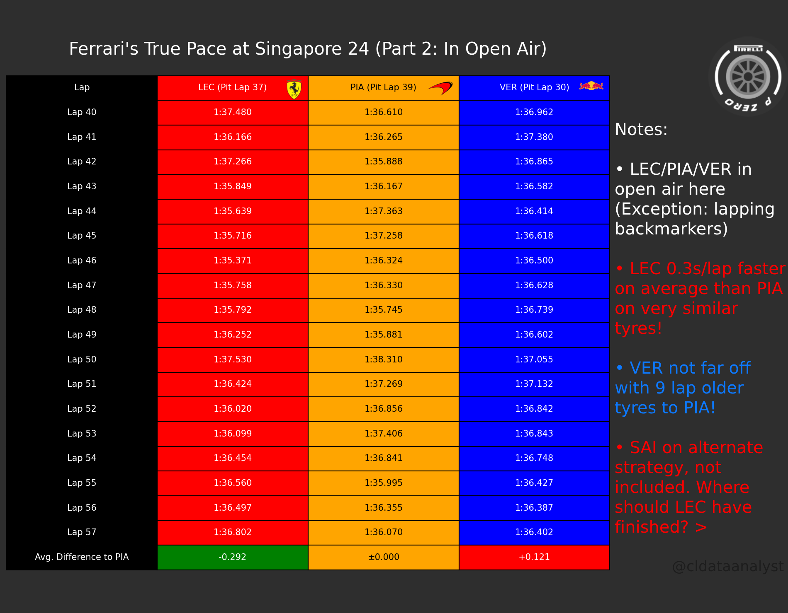

# 🏎️ F1 Driver Laptime Comparison Tool

A Python tool that generates a clear, side-by-side laptime comparison table for three Formula 1 drivers within a single race session.

---

## 📊 What It Does

The script uses [FastF1](https://docs.fastf1.dev/) to load race data, extracts laptimes for selected drivers, and displays:

- Each driver's lap time across a chosen lap range
- The lap-by-lap time difference relative to a reference driver
- The average delta over the selected stint
- A fully styled matplotlib table with customizable team colors, fonts, and chart size

Useful for race-pace analysis, stint comparisons, and driver performance breakdowns in an intuitive, visual format.

---

## 🖼️ Example Output

> **Ferrari's True Pace at Singapore GP 2024**
>
> Before the 2025 season begins, let's analyze something from last season: what would Ferrari's true pace have been at Singapore 2024?
>
> Singapore 2024 saw Ferrari line up 9th and 10th after a disastrous qualifying — not representative of their race pace at all.
>
> **Part 1** compares Piastri and Norris' first stint. The average laptime difference (~1s/lap) tells us Norris would've won regardless, even accounting for Piastri being held up by Verstappen and Mercedes. Leclerc was stuck behind Alonso/Hulkenberg in this stint, so his pace was even slower and hence excluded.
>
> **Part 2** compares Leclerc, Piastri and Verstappen across laps 40–57, where all three were largely in open air. A different story: Leclerc was on average **0.3s/lap quicker** than Piastri on very similar tyres. Verstappen was also impressively consistent — only **0.1s/lap slower** than Piastri on 9-lap older rubber.
>
> **Conclusion:** Without the qualifying disaster, Leclerc should've been at least on the podium, ahead of Piastri. Whether he could've beaten Verstappen's race pace is harder to say. Sainz was around Russell's pace — a likely P5, potentially P4 following Leclerc's strategy.

<p align="center">
  
  <br/><em>Part 1: Piastri vs Norris — First Stint</em>
</p>

> Note: The images above have been post-edited for the original Instagram post — the script generates the comparison table only. Additional text, context, and visual elements were added manually afterward.


<p align="center">
  
  <br/><em>Part 2: Leclerc vs Piastri vs Verstappen — Laps 40–57 (Open Air)</em>
</p>

---

## ⚙️ Setup

### Prerequisites

```bash
pip install fastf1 matplotlib
```

### FastF1 Cache

The script uses a local cache to avoid re-downloading session data. Make sure the cache directory exists:

```bash
mkdir fastf1_cache
```

---

## 🚀 Usage

Simply modify the variables at the top of the script and run it:

```python
session = fastf1.get_session(2024, 'Singapore', 'Race')  # Year, Circuit, Session
startlap = 40   # First lap to include
endlap = 58     # Last lap to include

driver1 = "Piastri"     # Reference driver (deltas calculated relative to this driver)
driver2 = "Leclerc"
driver3 = "Verstappen"

team_color = {
    'Driver1Team': ['black', 'orange'],   # [text color, background color]
    'Driver2Team': ['white', 'red'],
    'Driver3Team': ['white', 'blue']
}

chart_title = "Ferrari's True Pace at Singapore 24 (Part 2: In Open Air)"
chartsize = (20, 6)
fontsize = 20
```

Then run:

```bash
python laptime_comparison.py
```

---

## 📁 Project Structure

```
├── laptime_comparison.py   # Main script
└── fastf1_cache/           # Auto-populated cache directory
```

---

## 🔧 Customization

| Variable | Description |
|----------|-------------|
| `session` | Any FastF1-supported race, year, and session type |
| `startlap` / `endlap` | Stint window to analyze |
| `driver1/2/3` | Full driver surnames (FastF1 will resolve abbreviations) |
| `team_color` | Custom text/background colors per driver column |
| `chart_title` | Title displayed above the table |
| `chartsize` | Width × height of the output figure |
| `fontsize` | Font size for all table text |

---

## 📦 Dependencies

- [FastF1](https://github.com/theOehrly/Fast-F1) — F1 telemetry and timing data
- [Matplotlib](https://matplotlib.org/) — Table rendering and visualization

---

*Built by [Jazib Ahmed](https://github.com/jazib-17)*
